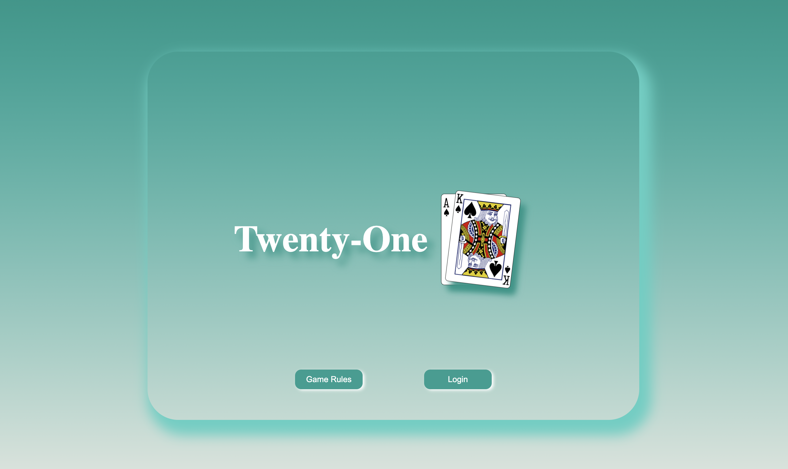
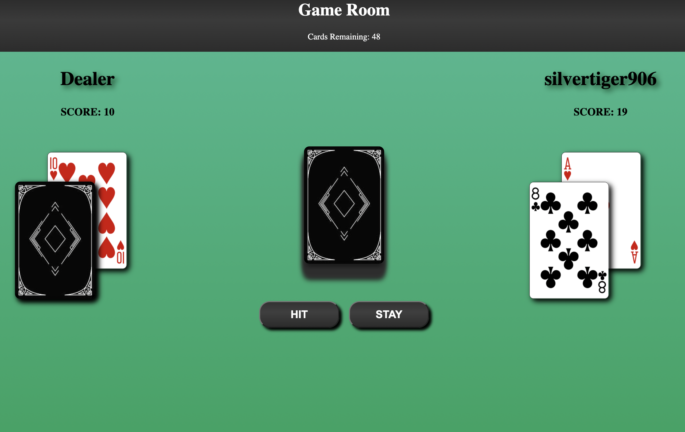

# Twenty-One
My front-end portfolio project is designed to simulate a simplified version of the game **Twenty-One**, also known as Blackjack and a few other names. This page makes api calls to the [deck of cards](https://deckofcardsapi.com/) api to simulate using a deck or multiple decks of cards. An api call is also made to [randomuser.me](https://randomuser.me) to generate random usernames. 

This project: 
- Has a deployed front-end application.
- Allows for user interaction through button clicks and form inputs.
- Makes requests to an external API.
- Has a card-playing game theme

[Click to view site](https://twentyonegame.netlify.app/).

# Table of Contents
- [Homepage](#homepage)
- [GameRoom](#game-room)
- [Additional Features](#additional-features)

# Homepage

The homepage uses a minimalist design with a center logo of the game and two buttons; one that open to a game rules card and the other to a login form.

The login form contains three inputs:  
- name input
- username input
- menu dropdown with three different card color options.

A user can not enter the game room until the login form is filled out correctly.

The login info is saved and used on the game room page through localStorage.

Javascript is used to:

- Make an initial api call to retrieve the ACE and KING of spades for the logo
- Listen for button clicks to show the game rules or the login form
- Show errors when the form is inputted incorrectly
- Navigate to the game room page

# Game Room

When the game room is loaded the user's info is retrieved from localStorage to display the username and the card color. An api call is made to retrieve a deck of cards with a specified deck id. This deck will be used through out the game play and shuffled when the deck dips below a number of cards remaining. The deck id is used to identify a valid deck as well as to ensure that the same deck is used the entire time. A new deck will be retrieved on every reload of the page.

Javascript is used to:

- Make api calls to retrieve deck info
- Calculate both the dealer and the player's scores
- Listen for button clicks to draw or card or pass a turn
- Simulate the dealer playing 

# Additional Features
- localStorage is used with the login form to store the user information that will be used in the game room.
- two different javascript files were used, one for the functionality of the home page and the other for the game room.
- when an error message appears on the login form the x button can be pressed to close the form and when the form is reopened the error message is gone.

[Table of Contents](#table-of-contents)